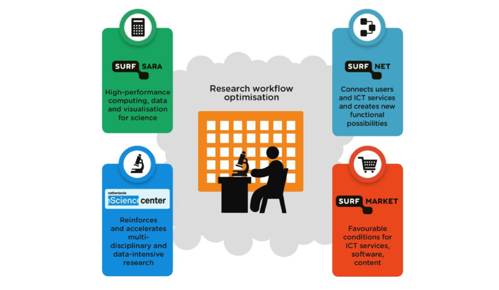
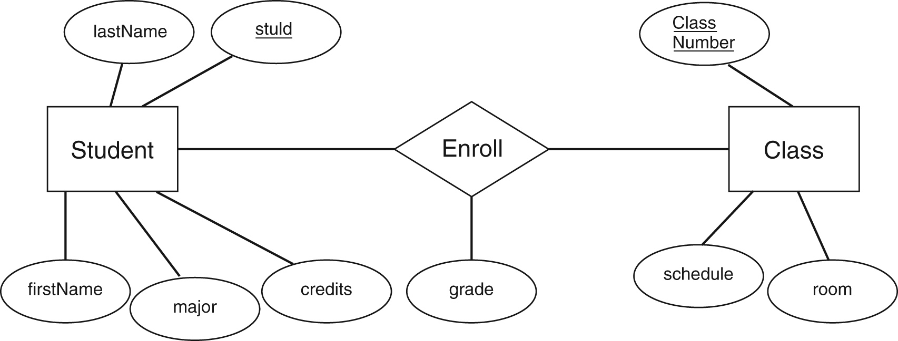
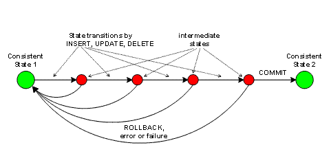

footer: SURFsara, 12-10-2015
slidenumbers: true
autoscale: true

# Databases - Part I
### SNE Master: Essential Skills

# [fit]

---


---



---

# Today

## Part I: Relational DB's
- What is a database
- Relational concepts
- SQL Basics
- Database design: E/R modelling
- Database design: Normalization
- Concepts: Indexes, Transactions, ACID 

---

# Today

## Part II: NoSQL and NewSQL
- Scaling out and distributed databases
- CAP Theorem
- Data models 
- NewSQL


---

# Today

## Part III: Hands-on PostgreSQL and MongoDB
- Create an E/R model
- Implement this in PostgreSQL
- Denormalize and implement in MongoDB


---

# What is a DBMS?

Consider a manufacturing firm whishing to computerize stock control:

1. *Production*: `{StockNO, Description, Level, Re_Order_Level, Unit_Cost}`
2. *Sales*: `{Customer_Name, Address, Invoice_No, ItemNo, Description, Amount, Item_Cost, Order_Cost, Credit_Limit}`
3. *Finance*: `{CustomerName, Invoice_No, Order_Cost, Payment_Received, Credit_Limit}`

Straightforward to implement as applications with dedicated files; but..

---

# What is a DBMS?

DBMS: Reduce redundancy and entropy:

1. Ambiguity: `ItemNo == StockNO`?
2. Inconsistency: 
    - update propagation: updates necessary on all three applications.
    - value/type inconsistency

---

# What is a DBMS?

1. Share and integrate data between different applications
2. Support multiple views of the same data
3. Controlled concurrent access to data
4. Ensure security and integrity

---

# Relational databases
__Two dimensional tables of rows and columns:__

*Tables*: relations
*Rows*: tuples
*Columns*: attributes
*Key attributes*: primary, candidate and foreign

Proposed by Dr E.F. Codd in the 1970s[^1]

^ - All relations have a heading: names of column
  - Each attribute as a domain (restriction on data types: NULL, atom, list, no multivalued columns)
  - Data integrity: keys and referential integrity (restrict, cascade, null)

---
# Relational databases

__Relational algebra:__

*RESTRICT*: return tuples based on conditions
*PROJECT*: return tuples with only a set of attributes
*TIMES*: return Cartesian product of two relations 
*UNION*: union of two sets of tuples
*MINUS*: subtract two sets of tuples

Derived: JOIN, INTERSECT, DIVIDE

---

# Structured Query Language: SQL

- SQL is a __declaritive language__ translated to relational algebra operations
- SQL has been the __de facto industry standard__ for relational systems
- SQL is a complete database language for:
    1. __data definition__
    2. __data manipulation__
    3. __data control__ (access control to views and tables)

---

# Data manipulation

__SQL has four data manipulation commands:__

*SELECT*: for retreiving data
*INSERT*: for inserting data
*UPDATE*: for altering data 
*DELETE*: for removing data

---

# Data manipulation: SELECT

```SQL
SELECT column_name,column_name
FROM table_name;
```

Or:

```SQL
SELECT *
FROM table_name;
```

Or: 

```SQL
SELECT DISTINCT column_name
FROM table_name
```

---

# Data manipulation: SELECT ... WHERE

```SQL
SELECT column_name,column_name
FROM table_name
WHERE column_name operator value;
```

Operators:
`=` *equals*
`<>` or `!=` *not equal*
`>` and `<` *greater than and lesser than*
`>=` and `<=` *greater than or equal and lesser than or equal*
`BETWEEN` *between an inclusive range*
`LIKE` *search for a pattern*
`IN` *to specify multiple values for a column*

---

# Data manipulation: SELECT ... WHERE ... AND ... OR

And:

```SQL
SELECT column_name1,column_name2
FROM table_name
WHERE column_name1 operator value
AND column_name2 operator value;
```

Or:

```SQL
SELECT column_name1,column_name2
FROM table_name
WHERE column_name1 operator value
OR column_name2 operator value;
```

---

# Data manipulation: Subqueries

```SQL
SELECT column_name1,column_name2
FROM table_name
WHERE column_name1 IN 
    ( SELECT column_name3
      FROM other_table_name
      WHERE column_name3 operator value );
```

Note: the scope of the subquery

---

# Data manipulation: Joins

```SQL
SELECT t11.column_name1,t1.column_name3
FROM table_name1 t1, table_name2 t2
WHERE t1.column_name1 == t2.column_name1
```

Or:

```SQL
SELECT column_name(s)
FROM table1
INNER JOIN table2
ON table1.column_name=table2.column_name;
```

Note: `JOIN` is the same as `INNER JOIN`


---

# Data manipulation: More joins

```SQL
SELECT column_name(s)
FROM table1
LEFT JOIN table2
ON table1.column_name=table2.column_name;
```
 
```SQL
SELECT column_name(s)
FROM table1
FULL OUTER JOIN table2
ON table1.column_name=table2.column_name;
```

Note: 'RIGHT/LEFT JOIN' is the same as `RIGHT/LEFT OUTER JOIN`

---

# Data manipulation: More joins

 `LEFT JOIN` 


 `FULL OUTER JOIN`

---

# Data definition

__SQL has several data definition commands:__

*CREATE TABLE*: for creating and specifying a table.
*ALTER TABLE*: for altering a table
*DROP TABLE*: for droping a table

---

# Data definition CREATE TABLE

```SQL
CREATE TABLE table_name
(
    column_name1 data_type(size) constraint_name,
    column_name2 data_type(size) constraint_name,
    column_name3 data_type(size) constraint_name,
....
);
```
Constraints:
`NOT NULL` *to indicate that a column cannot store NULL values*  
`UNIQUE` *to indicate that each row should have a unique value*
`PRIMARY KEY` *combination of NOT NULL and UNIQUE*
`FOREIGN KEY` *ensure referential integrity*
`CHECK` *ensures that the value meets a specific condition*
`DEFAULT` *specifies a default for a column*

Foreign key constraints: (RESTRICT, SET NULL, CASCADE) on UPDATE, DELETE 

---

# Data manipulation: INSERT, UPDATE, DELETE

```SQL
INSERT INTO table_name
VALUES (value1,value2,value3,...);

INSERT INTO table_name (column1,column2,column3,...)
VALUES (value1,value2,value3,...),(valueN,valueNN,valueNNN,...);
```

```SQL
UPDATE table_name
SET column1=value1,column2=value2,...
WHERE some_column=some_value;
```

```SQL
DELETE FROM table_name
WHERE some_column=some_value;
```
---

# SQL summary
- Declaritive language for:
    - data definition
    - data manipulation 
    - data control
- ANSI SQL Standard, but dialects per database implementation
- Typically implemented as relational algebra on relational model

---

# Database design: E/R modelling

Entity/relationship modelling: an approach to semantic modelling originally defined by P. Chen[^2].

Three fundamental components for an E/R model of a database:
1. __Entities__: items in the real world capable of unique existence.
2. __Attributes__: things describing an entity. Includes a key attribute: that part of an entity which gives it a unique identity
3. __Relationships__: a relationship represents the interaction between entities. Each relationship has a cardinality indicating the number of entities.

---

# Database design: E/R modelling - Entities

^Not always obvious if something should be modelled as an entity or attribute. 
For example a weak entity: a registration for a course depends on a course and a student. For example of a subtype: rekening: spaar, betaal (deposit, current)


We can identify __Entity types__:

__Strong entity__: Capable of 'independent' existence

__Weak entity__: Can only exist in terms of the relationship in which it participates 

We can use __subtyping__. 

---

# Database design: E/R modelling - Attributes

__Types of attributes__:
- Simple: atomic values
- Composite: multiples of simple attributes
- Derived: attributes derived from other attributes
- Single-valued attributes: contain a single value per entity
- Multi-valued attributes: may contain multiple values per entity

__Entity sets and keys__:
 - Super key: a set of attributes that identify an entity in an entity set
 - Candidate key: a minimal super key
 - Primary key: a candidate key chosen to uniquely identify an entity 

---

# Database design: E/R modelling - Relationships
Like entities relationships can have __descriptive attributes__

__Cardinality__ defines the number of participating entities:
    - One-to-one
    - One-to-many
    - Many-to-one
    - Many-to-many

---

### A simple E/R diagram



---

# From E/R model to database: 8 steps
1. For each strong entity create a table with columns for each simple attribute. The key attribute becomes the primary key.
2. For each weak entity create a table with columns for each simple attribute and include columns for the primary keys of those entities on which the entity depends (foreign keys).
3. When two entities are in a one-to-many relationship, the entity with the many cardinality must have a foreign key representing this relationship.
4. When two entities are in a one-to-one relationship, a foreign key must be included in one of the two.
5. When two entities are in a many-to-many relationship a table must be created consisting of foreign keys for the two entities.
6. When an entity has a multi-valued attribute, create a table with a column as foreign key to the entity and a column for the multi-valued attribute
7. When more than two entities participate in a relationship then a table must be created consisting of foreign keys to those entities.
8. When a subtyping is defined by attributes create separate tables for each subtype consisting of those attributes which are peculier to the subtype

---

# Database design: Normalization

Normalization: ensure efficienct data structures

Efficient data structures:
- Are not redundant in order to defeat inconsistency and ambiguity
    - look for update anomalies
    - look for insert anomalies
- Have a minimal use of NULL values
- Prevent loss of information
    - look for deletion anomalies 

Common problem: represent entities as (collection) of attributes

---

### Database design: Normalization


---

# Database design: Normal forms

A good database schema is in BCNF. 

Normal forms: 

- eliminate duplicate columns from the same table

- create separate tables from data which applies to multiple rows

- remove columns that are not dependent on the primary key (e.g. derived attributes)

---

# Concepts: Indexes

Extra data structure to __speed up__ access to a set of records.
<br>


---

# Concepts: Transactions

A transaction is a __logical unit of work__: Group commands into a single transaction with rollback and commit options.
<br>


---

# Concepts: ACID

__Atomicity__: each transaction is all or nothing.

__Consistency__: each transaction will bring the database from one valid state to the next.

__Isolation__: the concurrent (parallel) execution of transactions has the same result as executing them serially.

__Durability__: when a transaction has been completed, it will remain so

---

### Scaling relational databases


---

### Scaling relational databases


---

### Scaling relational databases


---

# Questions?

---

[^1]: [A Relational Model of Data for Large Shared Databanks](). Communications of the ACM, 13, June.

[^2]: [The Entity-Relationship Model: Toward a unified view of data](). ACM Transactions on Database Systems, 1, March.


