footer: SURFsara, 12-10-2015
slidenumbers: true
autoscale: true

# Databases - Part II
### SNE Master: Essential Skills

# [fit]

---

### Today

__Part II: NoSQL and NewSQL__
- NoSQL driving forces
- CAP Theorem
- Data models
- Hype? 
- NewSQL

---
### NoSQL - driving forces  

1. *Scaling out*: partitioning
2. *Performance*: remove complexity, simplify assumptions
4. *Impedance mismatch*: from relational data structures to programming language constructs

---
### Partitioning for RDBMS?
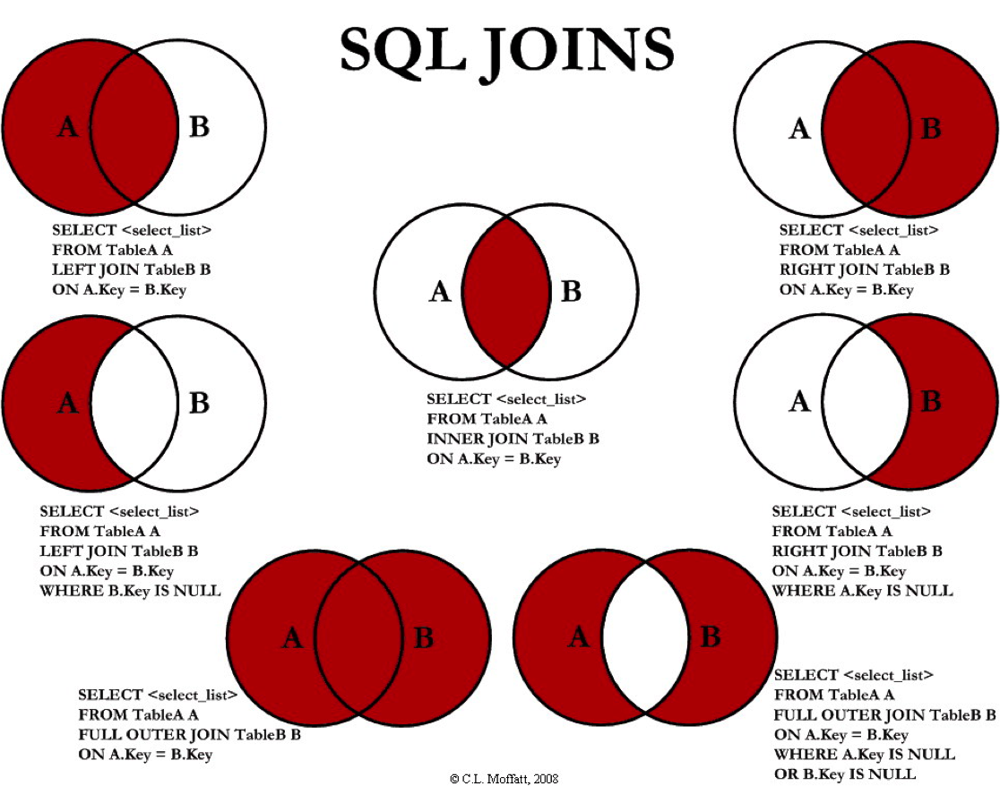
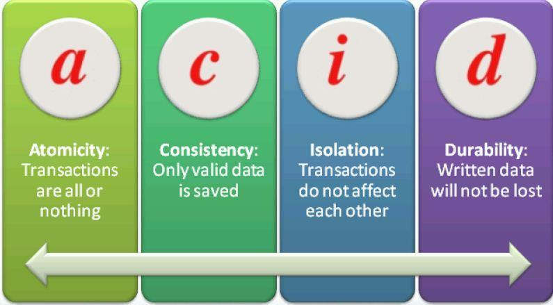

---
### Performance: The cost of not being on time

---
### Performance: The cost of not being on time
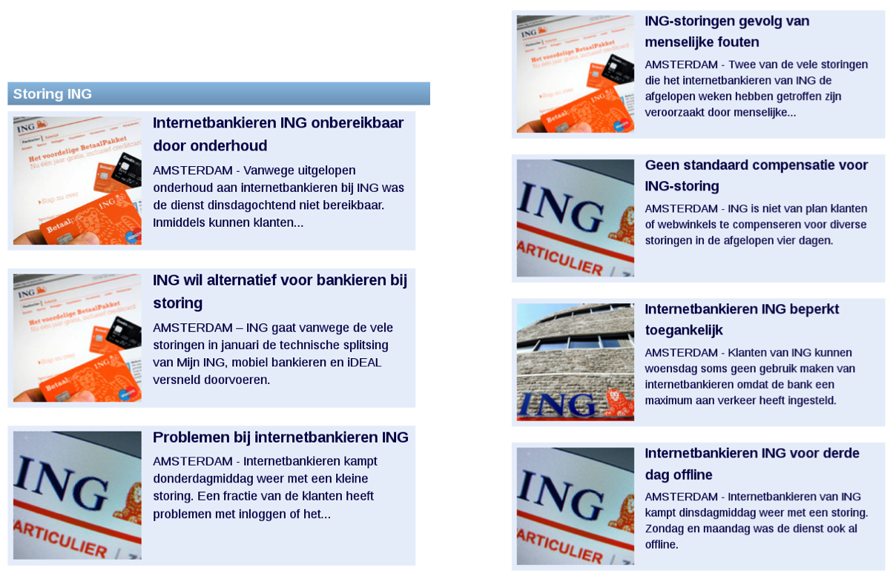

---
### Impedance mismatch

---
__Object oriented__
*vs.* __Relational__ data structures

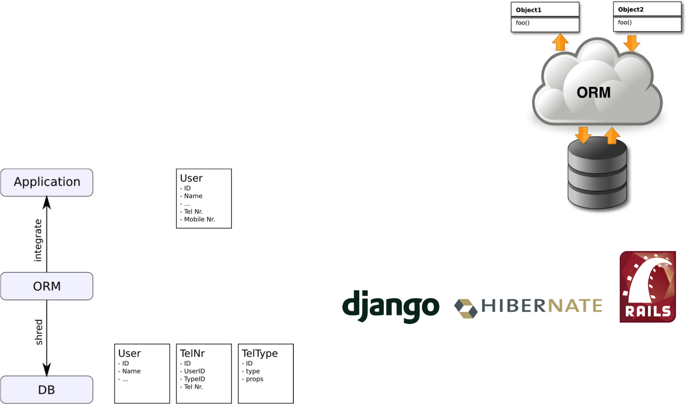

---
### Impedance mismatch

---
### Partitioning

---
### Partitioning

---
### Partitioning

---
### Partitioning and CAP

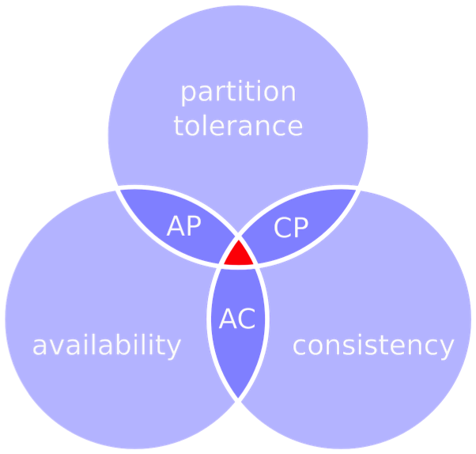

---
### Partitioning and CAP
__Consistency__: All nodes see the same data at the same time

__Availability__: A guarantee that every request receives a response about whether it succeeded or failed

__Partition tolerance__: Ability to cope with a partitioned network of system nodes

---
### Partition tolerance
 1. The network is reliable
 2. Latency is zero
 3. Bandwidth is infinite
 4. The network is secure
 5. Topology doesn't change
 6. There is one administrator
 7. Transport cost is zero
 8. The network is homogeneous

---
### Visual Guide to NoSQL systems
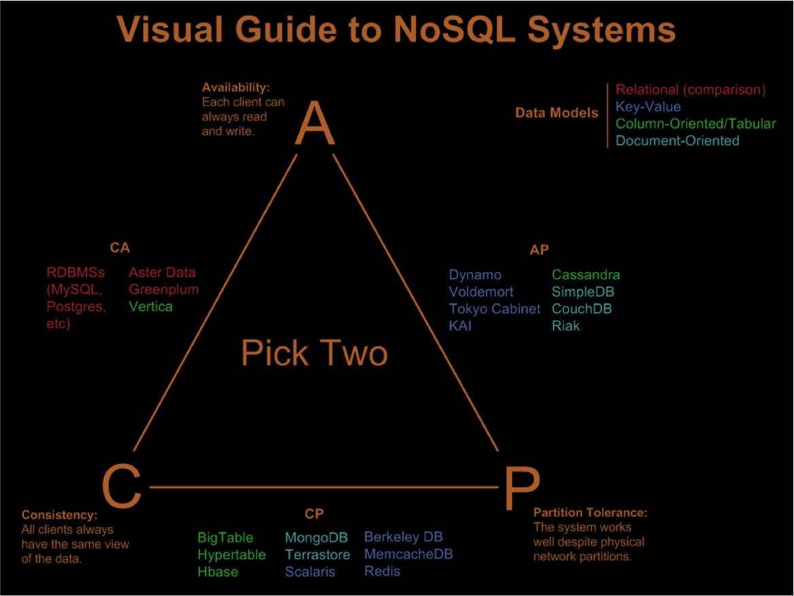

---
### CAP Misconceptions
1. CA?
2. No CA when P?
3. C is all or nothing
4. CAP is all about eventual consistency

---
### PACELC
__If Partioned__:
Tradeoff Availability and Consistency

__Else__:
Tradeoff Latency and Consistency

__Types of systems__:
- PC/EC -> Most consistent
- PA/EL -> No consistency but low latency
- PA/EC -> Give up consistency when partitioned
- PC/EL -> Madness? See PNUTS

---
### Consistency: atomicity and ordering

---
### Consistency: vector clocks
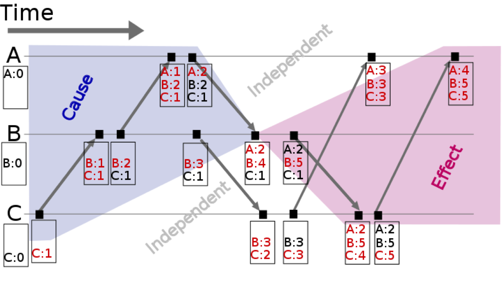

---
### Consistency: tunable CAP
__Riak__:
*N*: number of total copies
*R*: minimal number of responding clients when reading
*W*: minimal number of responding clients when writing

__Cassandra__:
Tunable write consistency
Tunable read consistency

__MongoDB__:
Write result setting
Read result setting

---
### Tunable CAP: Amazon shopping Basket

Amazon uses DynamoDB for shopping baskets. DynamoDB, like Riak is a distributed
key-value store where N-R-W can be set for operation.

If you were Amazon, how would you choose N-R-W for a shopping basket?

---
### Eventual consistency

__Key property of non-ACID__
    - If no further changes
    - All nodes will end up consistent

__Weak guarantee__
    - When is eventually? It doesn’t say..
    - In practice: expect inconsistency; always!

__In practice__:
    - Stronger guarantees: predicting/measuring behavior
    - Systems often appear strongly consistent

---
### Eventual consistency
__Nodes must exchange information on writes__:
    - Inform replicas
    - Inform client

__Deal with conflicts__:
    - Last write win?
    - Vector clocks
    - Multiversion storage
    - Hardware clocks

---
### Data models

---
### Data model: Column based
__Column stores__:
- HBase
- Cassandra
- MonetDB
- Google: BigTable

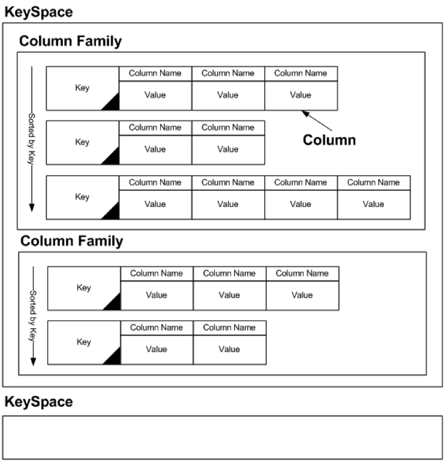

---
### Data model: Key-value
Similar to dictionaries and (hash)maps

__Key-value stores__:
- Riak
- DynamoDB
- Redis
- memcached

---
### Data model: Key-value
JSON Documents as data.

__Document stores__:
- MongoDB
- CouchDB
- CouchBase

---
### Data model: Graphs
Graphs and graph queries as first class citizens.

__Graph stores__:
- Neo4J
- OpenLink
- Titan

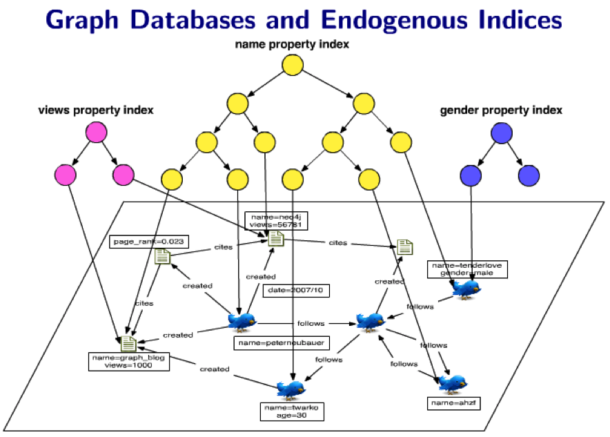

---
### Data model: Specialized
Distributed 
Lucene 
Indexes

---
### Hype?

---
### Hype?

---
### Hype?
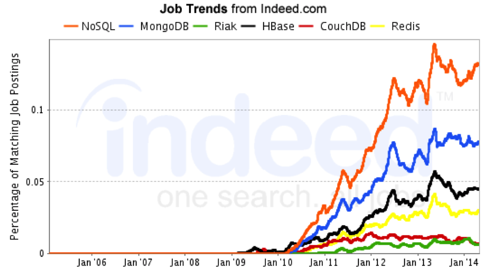

---
### Hype?

---
### Hype?

---
### Hype?

---
### Hype?

---
### Hype?
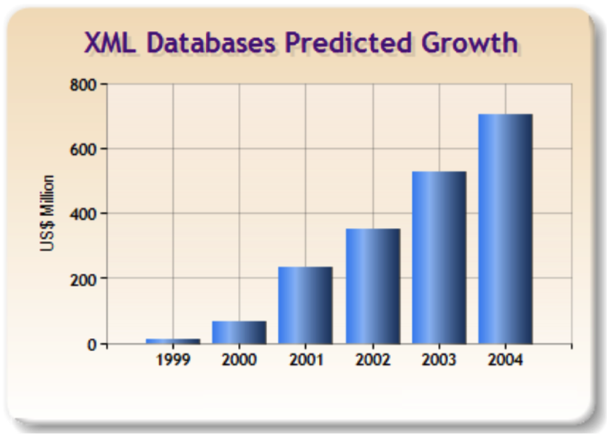

---
### Hype?

---
### Hype?

---
### Future directions
- Internal polyglot support
- Multi-model systems
- NewSQL: Can you have a scalable databases without going NoSQL? (“beating” CAP)
- Further support for NoSQL in RDBMs
- DBaaS and Baas

---
### Meanwhile at

---
### NewSQL

---
### NewSQL
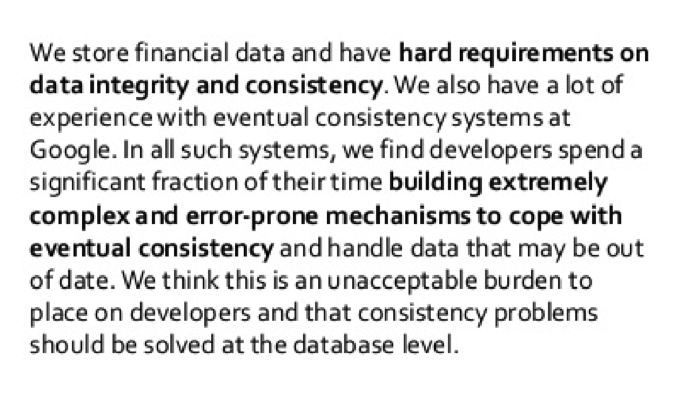

---
### NewSQL
Some Requirements:

__Scalable__
    - By adding hardware
    - No manual sharding
    
__Available__
    - No downtime,  ever

__Consistent__
    - Full ACID

__Usable__
    - Full SQL with indexes
   
 

---
### NewSQL

__Spanner__:
- Semi-relational distributed DB
    - SQL queries
    - Versioned data
- Consistent reads/writes
- Atomic schema updates
- High availability
- Removing nodes has no effect except on throughput (PC/EC)

__TrueTime__:
- Timestamp: consistent ordering on transactions
- Uses: GPS and atomic clocks

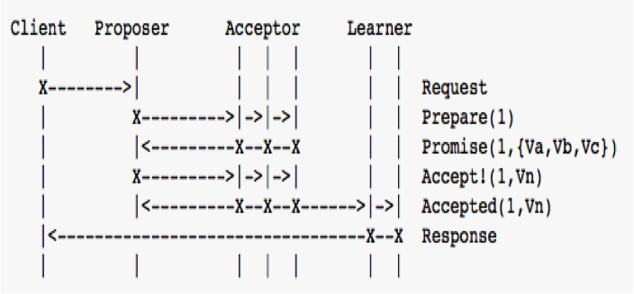 

---
### NewSQL
__F1__:
- Distributed SQL queries
- Consistent indexes
- Automatic change history (triggers)

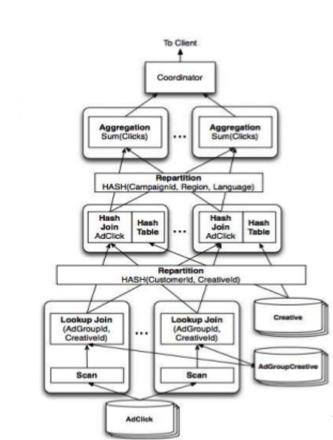 

---
### NewSQL
__F1__:
- 100 TB of uncompressed data 
    - Over 5 data centers
    - Five nines uptime

- Hundreds of thousands of request/second

- SQL queries scan trillions of rows/day

- No observable increase of latency compared to MySQL

- NoSQL (key -> row) and full SQL

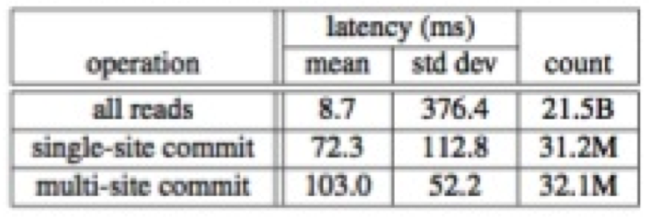 

---

### Beware of vendor speak

---
# Questions?

---
